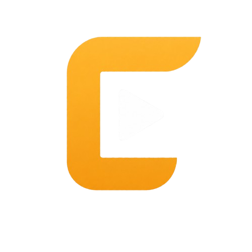

<p align="center">
  
</p>

<h1 align="center">FreeKliping</h1>

<p align="center">
  <a href="https://github.com/WannProject/freecliping">Source Code</a>
  ·
  <a href="https://saweria.co/freekliping">Support FreeKliping</a>
  ·
  <a href="https://www.wanndev.my.id">Developer Portfolio</a>
</p>

FreeKliping adalah aplikasi web untuk mencari momen dari video YouTube, memilih rentang waktu, lalu mengekspor klip MP4 tanpa akun. Aplikasi ini dibangun dengan Laravel, Inertia React, Tailwind CSS, yt-dlp, dan ffmpeg.

## Fitur

- Paste link YouTube untuk mengambil metadata video.
- Analisis rekomendasi momen klip dari video.
- Mode manual untuk memilih start dan end time sendiri.
- Ekspor klip ke MP4.
- Pilihan aspect ratio: original, 16:9, 9:16, dan 1:1.
- Pilihan kualitas output.
- Dukungan subtitle burn-in dan style subtitle.
- Output klip disimpan sementara dan dibersihkan otomatis.
- Rate limit dan batas antrean untuk mengurangi abuse.
- Halaman Privacy, Terms, link Source Code, dan copyright footer.

## Requirements

- PHP 8.3 atau lebih baru. Project ini dikembangkan dengan PHP 8.5.
- Composer 2.
- Node.js 22 atau lebih baru.
- npm.
- MySQL 8.4 atau database kompatibel.
- Redis, opsional untuk environment yang memakai Redis.
- yt-dlp.
- ffmpeg.
- Python 3, opsional untuk smart crop atau Whisper transcription.

Untuk development lokal, repo ini menyediakan `compose.yml` untuk MySQL dan Redis.

## Setup Lokal

Clone repo:

```bash
git clone https://github.com/WannProject/freecliping.git
cd freecliping
```

Jalankan service database:

```bash
docker compose up -d
```

Install dependency PHP:

```bash
composer install
```

Buat file environment dan app key:

```bash
cp .env.example .env
php artisan key:generate
```

Install dependency frontend:

```bash
npm install
```

Jalankan migration:

```bash
php artisan migrate
```

Generate route helper Wayfinder:

```bash
php artisan wayfinder:generate
```

Build asset frontend:

```bash
npm run build
```

## Menjalankan Aplikasi

Untuk development, jalankan server Laravel, Vite, queue worker, dan scheduler. Cara paling praktis:

```bash
composer run dev
```

Kalau ingin menjalankan manual di terminal terpisah:

```bash
php artisan serve
npm run dev
php artisan queue:work
php artisan schedule:work
```

Buka aplikasi di browser:

```text
http://127.0.0.1:8000
```

## Cara Menggunakan

1. Buka halaman utama FreeKliping.
2. Paste URL video YouTube.
3. Klik tombol untuk mencari klip.
4. Pilih rekomendasi momen yang tersedia, atau masuk ke mode manual.
5. Atur start time, end time, aspect ratio, kualitas, dan subtitle.
6. Klik generate/export.
7. Tunggu proses selesai.
8. Download file MP4 yang dihasilkan.

Catatan: pastikan kamu hanya memproses video yang kamu miliki, berlisensi, atau memang boleh kamu gunakan.

## Konfigurasi Penting

Sebagian besar konfigurasi ada di file `.env`.

```dotenv
APP_URL=http://127.0.0.1:8000
DB_CONNECTION=mysql
DB_HOST=127.0.0.1
DB_PORT=3307
DB_DATABASE=freecliping
DB_USERNAME=freecliping
DB_PASSWORD=freecliping

QUEUE_CONNECTION=database

FREEKLIPING_MAX_CLIP_LENGTH=180
FREEKLIPING_RETENTION_HOURS=1
FREEKLIPING_YT_DLP_BINARY=yt-dlp
FREEKLIPING_FFMPEG_BINARY=ffmpeg
FREEKLIPING_CROP_MODE=center
FREEKLIPING_SUPPORT_URL=https://saweria.co/freekliping

VITE_APP_NAME="${APP_NAME}"
VITE_DEVELOPER_WEBSITE_URL=https://www.wanndev.my.id
```

Beberapa opsi penting:

- `FREEKLIPING_MAX_CLIP_LENGTH`: durasi maksimal klip dalam detik.
- `FREEKLIPING_RETENTION_HOURS`: lama output klip disimpan sebelum dianggap expired.
- `FREEKLIPING_MAX_CONCURRENT_CLIPS`: batas global klip yang sedang antre atau diproses.
- `FREEKLIPING_MAX_PENDING_PER_IP`: batas request aktif per IP.
- `FREEKLIPING_CROP_MODE`: gunakan `center` untuk crop biasa atau `smart` untuk smart crop.
- `FREEKLIPING_WHISPER_ENABLED`: aktifkan transcription lokal jika dependency Whisper tersedia.

## Maintenance

Worker queue harus aktif agar proses analisis dan render klip berjalan:

```bash
php artisan queue:work
```

Scheduler membersihkan cache dan output klip yang expired:

```bash
php artisan schedule:work
```

Kamu juga bisa menjalankan cleanup manual:

```bash
php artisan clips:prune
```

## Testing

Jalankan test backend:

```bash
php artisan test --compact
```

Jalankan pemeriksaan frontend:

```bash
npm run types:check
npm run lint:check
npm run format:check
```

Jalankan semua pemeriksaan CI lokal:

```bash
composer ci:check
```

## Struktur Project

```text
app/Support/Clips       Logika metadata, analisis, rendering, subtitle, crop
app/Jobs                Background job untuk proses clip dan analysis
app/Http/Controllers    Endpoint web/API aplikasi
config/freekliping.php  Konfigurasi domain FreeKliping
resources/js/pages      Halaman Inertia React
resources/js/features   Komponen dan flow clip editor/studio
routes/web.php          Route web utama
routes/api.php          Route API local worker
tests                   Test Pest/Laravel
```

## License

FreeKliping adalah open-source software berlisensi GNU Affero General Public License v3.0 or later. Lihat file `LICENSE`.

Nama brand, logo, dan trademark FreeKliping tidak otomatis dilisensikan untuk reuse di luar ketentuan pemilik brand.
