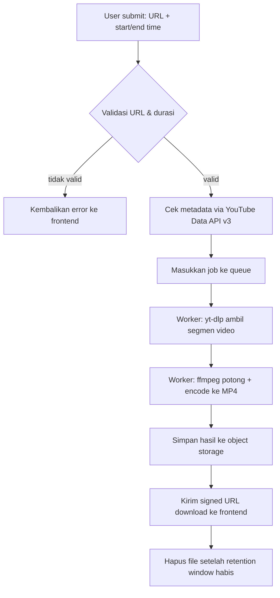

# FreeKliping — Dokumen Teknis: Alur Pemrosesan Klip (yt-dlp + ffmpeg)

| | |
|---|---|
| **Status** | Draft v1 |
| **Cakupan** | Phase 2–3 di PRD (backend sungguhan, belum dimulai) |
| **Terkait** | freekliping-prd-id.md — lihat bagian 11 (Risiko & Pertanyaan Terbuka) sebelum mengerjakan dokumen ini |

---

## 1. Tujuan Dokumen

Menjelaskan tools dan alur kerja teknis di balik backend FreeKliping yang
sesungguhnya (belum diimplementasi) — bagian yang mengambil video dari
YouTube dan memotongnya sesuai timestamp in/out yang dipilih pengguna di
UI, lalu menghasilkan file klip yang bisa diunduh.

Frontend (yang sudah dibangun) tidak berubah — dokumen ini hanya membahas
apa yang terjadi di belakangnya begitu tombol **Generate clip** benar-benar
memanggil server sungguhan, bukan simulasi.

---

## 2. Tools yang Digunakan

| Tool | Peran |
|---|---|
| **YouTube Data API v3** | Ambil & validasi metadata (judul, channel, durasi) sebelum proses download — jalur resmi, legal |
| **yt-dlp** | Mengambil stream video dari YouTube |
| **ffmpeg** | Memotong video sesuai in/out point, lalu encode ke MP4 |
| **Job queue** (mis. BullMQ + Redis) | Menjalankan proses download+potong secara asinkron di background, bukan blocking request |
| **Object storage** (mis. S3-compatible) | Menyimpan file hasil klip sementara sebelum diunduh pengguna |

---

## 3. Alur Kerja (High-Level)



## 4. Detail Tiap Tahap

### 4.1 Validasi awal
Backend memvalidasi format URL dan memastikan panjang klip yang diminta
tidak melebihi batas (sesuai `MAX_CLIP_LENGTH` yang sudah ada di frontend,
mis. 180 detik) **sebelum** menyentuh yt-dlp sama sekali — mencegah proses
berat berjalan untuk request yang jelas tidak valid.

### 4.2 Ambil metadata
Panggil YouTube Data API v3 untuk konfirmasi video benar-benar ada, publik
(bukan private/unlisted-restricted), dan durasinya masuk akal dibanding
timestamp yang diminta user.

### 4.3 Ambil video — yt-dlp
Alih-alih mengunduh keseluruhan video (boros bandwidth & storage untuk
video panjang), gunakan fitur **`--download-sections`** milik yt-dlp untuk
langsung mengambil hanya rentang waktu yang dibutuhkan plus sedikit buffer
di kedua sisi (mis. ±3 detik) untuk jaga-jaga alignment keyframe.

Contoh pola perintah (disesuaikan lagi saat implementasi):

```
yt-dlp --download-sections "*START-END" -f "bv*+ba/b" -o "source.%(ext)s" <URL>
```

### 4.4 Potong presisi — ffmpeg
Karena `--download-sections` di yt-dlp kadang tidak 100% presisi ke frame
(tergantung posisi keyframe sumber), ffmpeg dipakai sebagai tahap kedua
untuk memotong tepat ke timestamp yang diminta dan re-encode ke MP4 yang
konsisten:

```
ffmpeg -i source.mp4 -ss <start> -to <end> -c:v libx264 -c:a aac output.mp4
```

Re-encode (bukan `-c copy`) dipilih supaya potongan akurat ke frame yang
diminta user, bukan cuma ke keyframe terdekat — konsekuensinya proses ini
butuh CPU, sehingga wajib berjalan di background job, bukan di request
path langsung.

### 4.5 Simpan & kirim hasil
File hasil disimpan sementara di object storage, backend mengembalikan
signed URL (kadaluarsa otomatis) ke frontend untuk tombol **Download clip**
menggantikan file dummy `.txt` yang dipakai di prototipe saat ini.

### 4.6 Pembersihan
File sumber dan file hasil dihapus otomatis setelah periode retensi
pendek (mis. 1–24 jam) — selaras dengan posisi privasi yang sudah
dituliskan di halaman `/privacy`: tidak ada data yang disimpan lama.

---

## 5. Penanganan Error

| Kasus | Penanganan |
|---|---|
| Video private/tidak tersedia/dibatasi wilayah | Tolak di tahap validasi metadata, tampilkan error state yang sudah ada di `UrlInput` |
| Video melebihi batas panjang klip | Tolak sebelum masuk queue |
| yt-dlp gagal ambil stream (YouTube ubah struktur) | Retry terbatas, lalu gagalkan job dengan pesan jelas — lihat catatan maintenance di bawah |
| ffmpeg gagal encode | Gagalkan job, jangan kirim file rusak ke user |
| Job menumpuk / server overload | Batasi job bersamaan per IP, tolak request baru dengan pesan "coba lagi nanti" |

---

## 6. Catatan Infrastruktur & Maintenance

- **yt-dlp perlu update rutin** — YouTube sering mengubah struktur
  internalnya sehingga extractor yt-dlp bisa "patah" tiba-tiba. Pin versi
  di Docker image tapi siapkan proses update cepat, bukan versi yang
  dibekukan permanen.
- **Proses download+encode itu berat** — wajib jalan di worker terpisah
  dari web server utama (job queue), supaya request HTTP biasa tidak ikut
  ke-block oleh proses ffmpeg yang bisa makan waktu beberapa detik hingga
  menit tergantung panjang klip.
- **Tanpa login berarti tanpa identitas user** — rate limiting realistis
  hanya bisa berbasis IP/fingerprint kasar, bukan akun. Ini trade-off
  langsung dari prinsip "No Login" di PRD, perlu disadari sejak desain
  sistem, bukan ditambal belakangan.

---

## 7. Pengingat Legal

Sebelum bagian ini benar-benar diimplementasikan dan dipublikasikan,
tinjau ulang bagian **Risiko & Pertanyaan Terbuka** di PRD — penggunaan
yt-dlp untuk mengambil konten YouTube berada di area yang berpotensi
bertentangan dengan Terms of Service YouTube. Dokumen ini menjelaskan
*cara kerja teknisnya*, bukan konfirmasi bahwa ini aman secara hukum untuk
dijalankan publik.
